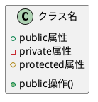
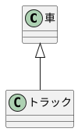
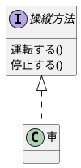
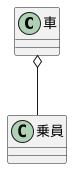
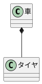
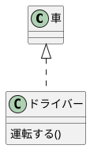

# Class Diagram

クラスはオブジェクトの設計図であり、オブジェクトはクラスのインスタンスである。
オブジェクトは状態（State）と振る舞い（Behavior）を持つ。

## 表記法

以下の 3 つで表現する。

- 名前（Name）
- 属性（Attribute）
- 操作（Method）

属性とメソッドの Visibility は以下の 3 つの記号で表記する。

- `+`：public
- `-`：private
- `#`：protected

## 関係性（Relation）

### 汎化（Generalization）

- "is-a"関係（トラック is a 車）
- 継承と同義
- 抽象クラス名はイタリックで記述する
- 「車」は「トラック」の汎化（Generalization）
- 「トラック」は「車」の特殊化（Specialization）

### 実現（Realizatino）

- インターフェイスと同義
- 「車」は「操縦方法」を実装している

### 関連（Association）

#### 集約（Aggregation）

- 関連の一種
- "part-of"関係（乗員 is part of 車）
- 「車」と「乗員」は別々のライフタイムを持つ

#### コンポジション（Composition）

- 関連の一種
- "part-of"関係（タイヤ is part of 車）
- 「車」と「タイヤ」は共通のライフタイムを持つ

#### 依存（Dependency）

- 関連の一種
- 「車」を変更すると「ドライバー」に影響する

## 多重度（Cardinality）

## References

- [UML Class Diagram Tutorial](https://www.visual-paradigm.com/guide/uml-unified-modeling-language/uml-class-diagram-tutorial/)
