# WSL2 上の Docker に CUDA + PyTorch 開発環境を構築する

Windows の WSL2 上に、PyTorch 開発環境を構築する手順です。Docker と CUDA が利用可能です。

構築する環境は以下のような構成となります。



## 前提

-   CUDA 対応の GPU（NVIDIA）
-   WSL2
-   VS Code

## 構築手順

### NVIDIA ドライバーのインストール（WSL2）

WSL2 上に最新の NVIDIA ドライバーをインストールします。

まず、古いドライバーを削除します。

```bash
apt-get --purge remove nvidia-*
apt-get --purge remove cuda-*
```

最新のドライバーをインストールします。

```bash
apt-get update
apt-get install ubuntu-drivers-common
ubuntu-drivers devices # 一覧の中で recommended のドライバーを確認
apt-get install nvidia-driver-525 # recommended のドライバーをインストール
```

PC 再起動後、以下のコマンドで GPU に対応する CUDA のバージョンを確認します。（画像では 12.3）


### Docker Desktop のインストール（Windows）

[こちらの記事](https://zenn.dev/ttani/articles/wsl2-docker-setup)の手順にてインストールできます。

### CUDA 対応の Docker コンテナの立ち上げ（WSL2）

コンテナを起動し、コンテナ内部で PyTorch 等ができることを確認します。動作確認として[threestudio](https://github.com/threestudio-project/threestudio)を利用します。

まず、適当なディレクトリに threestudio の Git リポジトリをクローンします。

```bash
cd ~/workspace
git clone https://github.com/threestudio-project/threestudio
```

次に、ローカルにクローンした threestudio リポジトリを VS Code で起動します。

```bash
code ./threestudio
```


左のアイコンから拡張機能を選択し、「remote」で検索します。検索結果から「Remote Development」をインストールします。（画像の一番上の拡張機能）


これにより、VS Code から直接 Docker コンテナにアクセスする準備が整いました。

次に、ワークスペース内に`.devcontainer`フォルダを新規作成し、その中に`devcontainer.json`と`Dockerfile`の 2 つのファイルを作成します。


各ファイルの中に以下をコピーします。

```json title="devcontainer.json"
{
    "name": "Python 3.10",
    "build": {
        "dockerfile": "Dockerfile",
        "context": "."
    },
    "customizations": {
        "vscode": {
            "extensions": [
                "VisualStudioExptTeam.vscodeintellicode",
                "esbenp.prettier-vscode",
                "KevinRose.vsc-python-indent",
                "EditorConfig.EditorConfig",
                "ms-python.vscode-pylance",
                "ms-python.python",
                "bungcip.better-toml"
            ]
        }
    },
    "settings": {
        "terminal.integrated.defaultProfile.linux": "zsh",
        "terminal.integrated.profiles.linux": {
            "zsh": {
                "path": "/bin/zsh"
            }
        }
    },
    "runArgs": ["--gpus", "all", "--shm-size", "16gb"],
    "postStartCommand": "git config --global --add safe.directory ${containerWorkspaceFolder}"
}
```

```Dockerfile title="Dockerfile"
FROM nvidia/cuda:12.1.0-cudnn8-devel-ubuntu22.04

ENV TZ=Asia/Tokyo
ENV DEBIAN_FRONTEND=noninteractive
RUN apt-get update && apt-get install -y --no-install-recommends \
    bat \
    build-essential \
    curl \
    exa \
    git \
    python3-pip \
    python3-dev \
    libopencv-dev \
    make \
    tzdata \
    vim \
    zsh
RUN sh -c "$(curl -fsSL https://starship.rs/install.sh)" -y -f
RUN apt-get autoremove -y
RUN ln -s /usr/bin/batcat /usr/local/bin/bat
ENV POETRY_HOME=/opt/poetry
RUN curl -sSL https://install.python-poetry.org | python3 -
RUN cd /usr/local/bin && \
    ln -s /opt/poetry/bin/poetry
RUN pip install ninja
RUN pip install torch torchvision torchaudio
```

上記でコンテナの起動構成を記述したので、次に実際にコンテナを起動してアクセスします。VS Code 左下の「><」のようなボタンをクリックし、表示されたメニューから「コンテナーで再度開く」を選択します。


少し時間がかかりますが、コンテナの準備ができると自動で新しい VS Code の画面が表示されます。その画面で`control + J`でコマンドパネルを表示し、ターミナルに以下を打ち込み、正常に学習が開始されるかを確認します。

```bash
python launch.py --config configs/dreamfusion-sd.yaml --train --gpu 0 system.prompt_processor.prompt="a zoomed out DSLR photo of a baby bunny sitting on top of a stack of pancakes"
```

エラーが出ずに、以下のような出力がされれば成功です。


